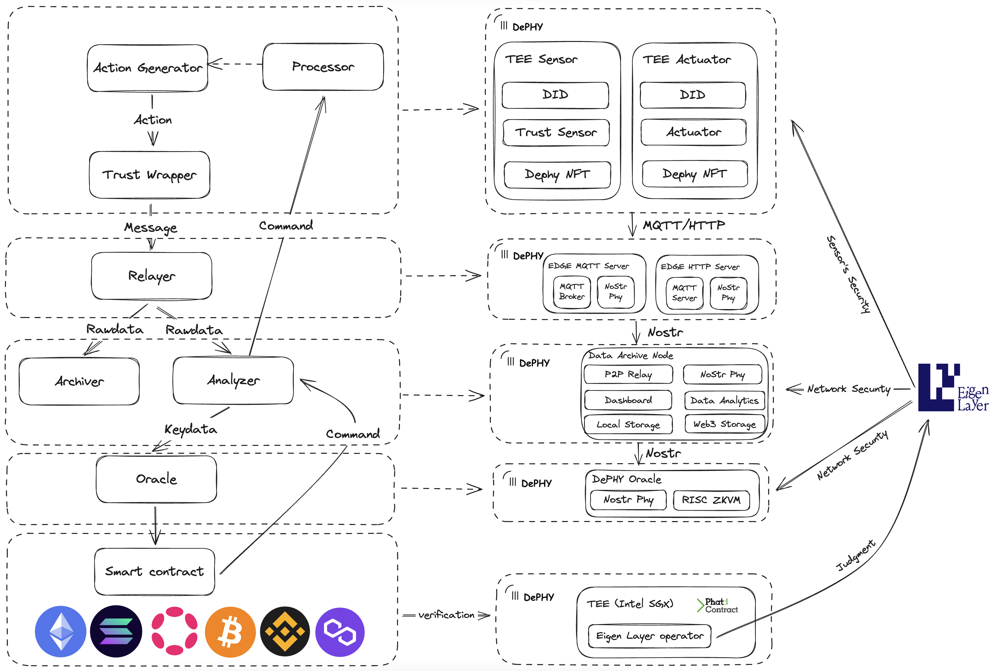

# Introduction

DePHY is a decentralized low-latency off-chain network for DePIN with verifiability and composability.

## Why Web3 needs real-world

- The physical and blockchain worlds exist as separate entities, yet there’s a critical interplace between them
- The virtual world needs real input
    - The evolving landscape of software development is increasingly focused on creating applications that address real-world challenges
    - A significant void exists in Web3 regarding authentic data sources that reflect real-world dynamics
    - This disparity between the demand for real-world integrations and the current offerings in the Web3 space highlights a pressing need for bridging these two realms
- Revolutionizing economics through digital integration
    - Historically, translating real-world actions into valuable digital assets or incentives has been a slow and complex process.
    - The prevailing trend of data monopolization by centralized entities (often large corporations) underscores the need for a new economic model that leverages decentralized technologies.

## Verifiability

### How DePHY provide verifiability?

- **DID (Device ID) Based on Trustzone-Optee**
    - **Hardware Wallet-Level Security:** This feature mimics the security level of a hardware wallet, ensuring the highest security for device IDs.
    - **Hardware-Level Authorization:** By implementing authorization directly at the hardware level, it significantly boosts security and reliability.
    - **Authenticity of Data:** This system guarantees that the data collected is authentic, thereby enhancing trust in the data's integrity.
    - **Bi-Directional Verifiability:** This allows for rapid detection and handling of cheating attempts, employing slashing mechanisms to maintain honesty in the network.
- **Building a trust chain from the hardware layer**
    - **Root Secret in eFuse:** The root secret is securely embedded in eFuse, offering physical tamper-proofing and enhancing device security.
    - **TrustZone Integration:** Ensures that all sensitive keys and function calls are securely protected at the hardware level, fortifying the system against unauthorized access.
- **Fully Decentralized Depin Data Access Points**
    - **Decentralized P2P Network via Nostr:** Establishes a peer-to-peer network leveraging Nostr, promoting decentralized communication.
    - **Decentralized Access to Off-Chain Physical Devices:** This is achieved through distributed Edge Servers, facilitating decentralized access and control over physical devices.
- **Our protocol enforces signing every message to ensure verifiability**
    - **Prevention of Replay Attacks:** The protocol's design inherently guards against replay attacks, ensuring communication authenticity.
    - **Remote Attestation Technology:** Supports Remote Attestation, validating that special firmware is operational in TrustZone, further affirming system integrity.

### Proof of Action

#### What is Proof of Action?

TODO

#### Why need Proof of Action?

TODO

## Composability

### How DePHY provide composability?

- **Standardized Embedded Interfaces, Providing Hardware Solutions:**
    - **Universal Standard Services:** Interfaces like MQTT and HTTP are universally standardized, facilitating easy integration and communication.
    - **Open-Source Reference Designs:** These designs are fully open-source, simplifying compatibility with various supply chains and promoting transparency.
- **Versatile Compatibility with Various Systems:**
    - DePhy's technology is designed to be compatible with a wide range of systems, including advanced GPUs and X86 architectures, ensuring broad applicability and flexibility.
- **Robust Support for Arduino Open Source Hardware:**
    - **Extensive Library of Open Source Sensors and Actuators:** With tens of thousands of options available, DePhy offers a rich repository of resources for development.
    - **Vast Community of Developers and Resources:** The platform is supported by a large community of developers, along with a wealth of development samples, fostering a collaborative and resource-rich environment.
    - **Rapid Device Assembly:** The system is designed for efficiency; you can build your DePin device in as little as 30 minutes, making it accessible even for those with limited technical expertise.

## How does DePHY work?

- **DID of DePin Devices**
    - **Unique Key Pairs for Each Device:** Every DePhy device is assigned a distinct and permanent pair of keys, ensuring a secure and unique digital identity.
    - **Blockchain Integration for Identity Verification:** On the blockchain, each device is linked to a specific token. This token is crucial for confirming the device's identity and authenticating its communications with the blockchain network.
- Decentralized DePin Network Operating Off-Chain
    - **MQTT Protocol for Streamlined Communication:** The network leverages the MQTT protocol, widely recognized in the IoT industry, to facilitate device communication. This choice significantly eases integration challenges and minimizes hardware demands.
    - **NoStr Protocol for Enhanced Networking:** To meet the low latency demands of IoT, DePhy utilizes the NoStr protocol. This enables the network to achieve decentralization, flexible connectivity, effective message filtration and prepares the ground for incorporating payment systems in the future.
    - **Diverse Nodes for a Robust Network:** The network's backbone is formed by "Archive Nodes." DePhy permits the integration of nodes serving various roles, such as data visualization, IoT device gateways, data oracles, and analytics, broadening the network's functionality.
- Through data Oracle network nodes, data reported by DePin devices can be submitted to the blockchain. Its validity can be verified through DePin DID.

## Why DePhy can decentralized？

- Use edge endpoint to connect with DePin devices
- DePhy is based on the NoStr protocol that everyone can host nodes
- Fully open-source hardware design, no supplier binding
- Nostr network connects all edge servers and blockchain

# **What is the difference between other projects?**

|  | DePhy | W3bstream |
| --- | --- | --- |
| Connection | decentralized | centralized |
| Edge server | Y | N |
| Data privacy | Y | N |
| Trustable Data | Y | N |
| Data rate | Could be lower than 100ms | More than 1s |
| Web3 control real-world | Y | N |
| Quickly hardware developing | Y | N |
| Tokennomic | Y | Y |